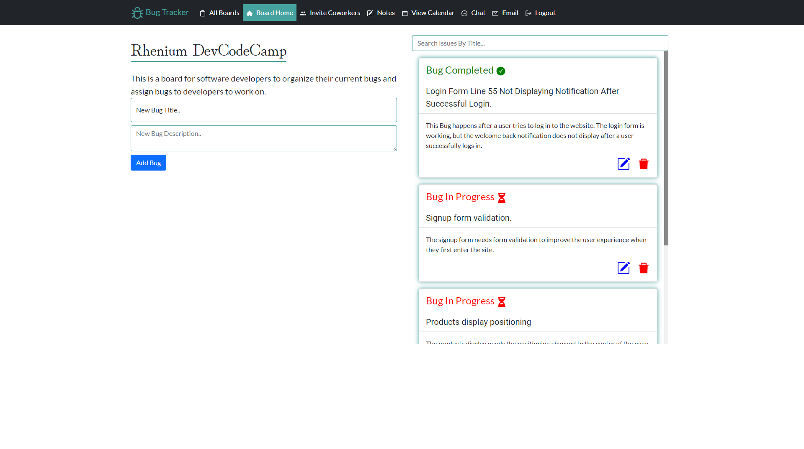
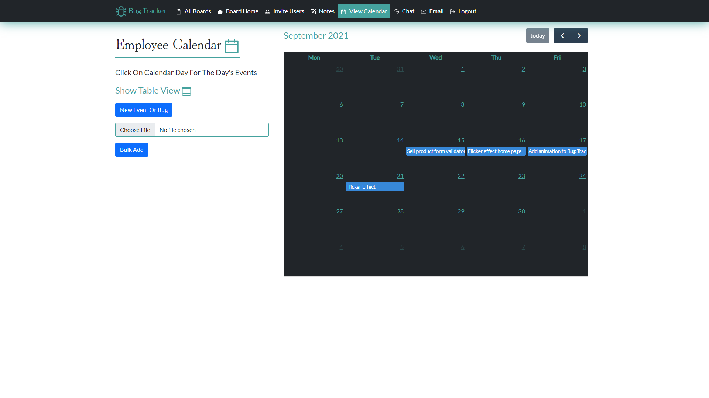
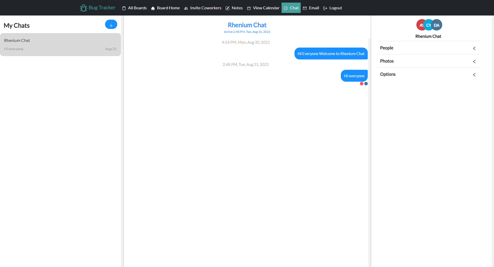
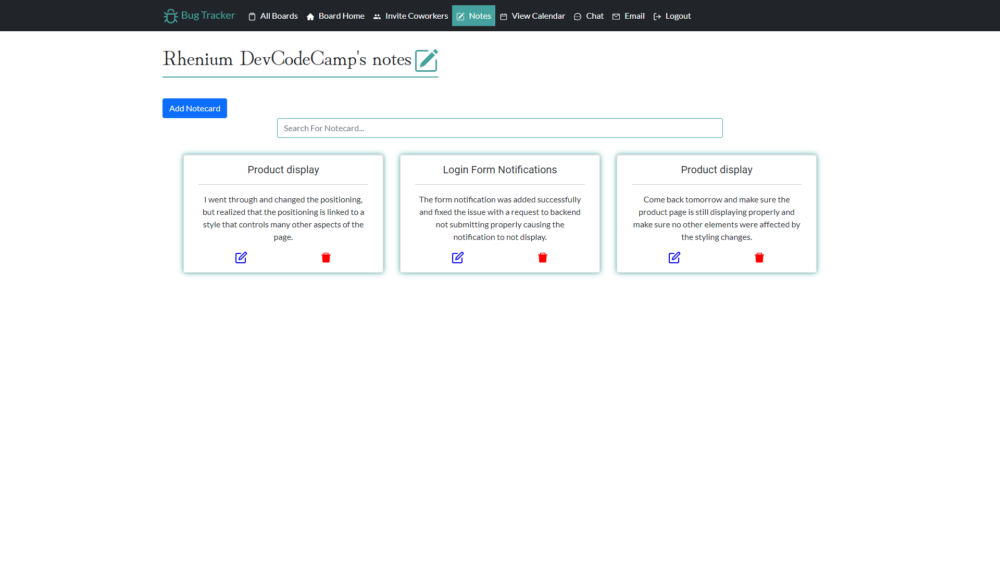

# Bug Tracker
## Implementation of a bug tracking web application

Creates a pleasing user interface for Software Developers looking to track what bugs they have completed and not completed.

## Table of Contents
- [Project Status](#project-status)
   - [Goals](#goals)
   - [Task List](#task-list)
   - [Future Tasks](#future-tasks)
- [Technologies](#technologies)
- [Bugs](#bugs)
- [Images](#images)

---
## Project Status :green_circle:
### Goals
- Create a pleasing User Interface
- Enable a user to chat within the web application
- Enable a user to email another application user
- Enable a user to view their tasks displayed on a calendar or a table view
- Enable a user to add a new member to their board, Change a users role, and remove a member from a board
- Enable a user to upload a .csv file to bulk update their events and bugs
- Enable a user to mark a bug as complete or in complete
- Enable a user to take notes within the application

### Task List: 
:heavy_check_mark: Create a pleasing User Interface 

:heavy_check_mark: Enable a user to chat within the web application

:heavy_check_mark: Enable a user to email another application user

:heavy_check_mark: Enable a user to view their tasks displayed on a calendar or a table view

:heavy_check_mark: Enable a user to add a new member to their board, Change a users role, and remove a member from a board

:heavy_check_mark: Enable a user to upload a .csv file to bulk update their events and bugs

:heavy_check_mark: Enable a user to mark a bug as complete or in complete

:heavy_check_mark: Enable a user to take notes within the application

:heavy_check_mark: Added copy functionality for a users email in email section of a board

<!--- 
Emojis for the Task List:
DONE =      :heavy_check_mark:
NOT DONE =  :x:
WIP =       :recycle:
BUGGED =    :warning:
 --->

### Future Tasks  
:x: Add ability to change between light and dark mode 

:x: Add a settings option to allow users to change their password or remove a board

---
## Technologies
- Visual Studio Code
- ASP.NET Core Web API
- React
- Framer Motion API
- EmailJS API
- Chat Engine IO Api
- React Testing Library API
- Full Calendar API
- Toastify API
- React Bootstrap
- Bootstrap
- Git / GitHub

## Knowledge Used
- CSS
- Bootstrap
- React
- Framer Motion API
- Toastify API
- EmailJS API
- C#
- ASP.NET Core Web API

---
## Design
### Home
- Implemented a main home that displays a users boards, invited boards and the add board form.
- Implemented a board home that displays a new bug form and all of a users bugs in a scrollable container
### Board Home
- Implemented a form so a user can create a new bug 
- Implemented a search bar to allow a user to search through bugs
- Implemented a checkbox to allow a user to mark a bug as complete
- Implemented a modal to allow a user to update a bug
- Implemented a delete icon for a bug
### Calendar
- Implemented a Modal for adding a new event or bug
- Implemented a file upload for a .csv file
- Implemented a calendar with clickable days
- Implemented functionality for moving an event by dragging it to another day on the calendar
- Implemented a form for sending an email to another user and displaying a boards user for a visual reference
### Notes
- Implented a modal for creating a new notecard
- Implemented a modal for updating a notecard
- Implmented a modal to check if a user wants to remove a notecard
- Implemented React Bootstrap Card for styling
- Implemented a search bar for the Notecards section
### Chat 
- Implemented functionality for a user to access the chat using the password they used to sign up for the website
- Implemented Chat Engine API to allow a user to be able to easily communicate with each other

---
## Bugs
- Uploading .csv file with information in the wrong order:
   - Currently a user can upload a .csv file and if in the wrong order will cause a bug to occur and return an error message notification for a user .

---
### Images

---

---

