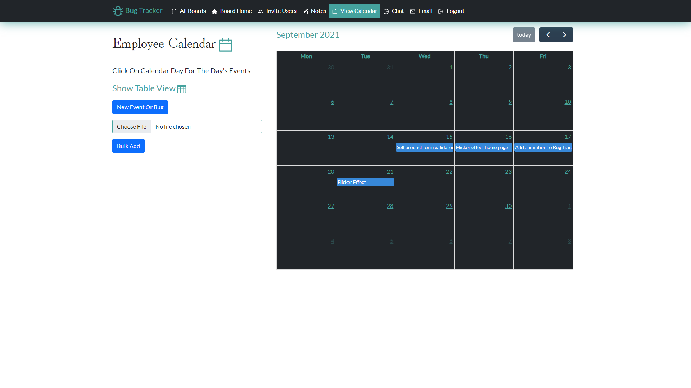

This app was created using React for the front-end and ASP.NET Core for the back-end of this application.

This application consists of multiple APIs to make me even more comfortable with using APIS while programming. I made this application for Software Developers looking for a way to track the bugs in their applications. The app comes with a system for emailing other users, chatting with other users, taking notes, and keeping track of your bugs to work on with a clickable calendar that displays the bugs to work on for the day with the assignees.

The Board Home consists of showing the bugs and if you are an admin of the board you can create a new bug or mark a bug as complete or in progress.

The Board Calendar consists of a calendar view and a table view with a display for users to show them bugs they are assgned to and has clickable days to give a good idea of what tasks a user has for the day. The admin has access to the delete and create functionality of the calendar shown in the image.

The Board Chat is for developers who want to chat with any other user in the site. Any user can create a new chat and add a user to it. If a user wanted to chat with the head developer board their is a search bar for ease of use to start a chat with that user.

The Board Notes section is independent to who the user is and which board it is. A user can create notes for seperate boards and keep track of those notes for each board with a built in searchbar. Any user also has access to the CRUD functionality of the notes section.

